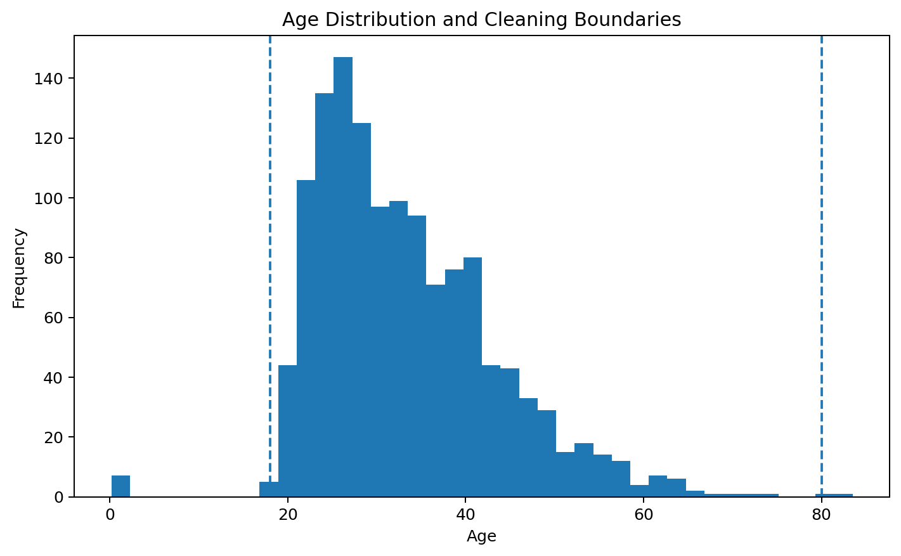
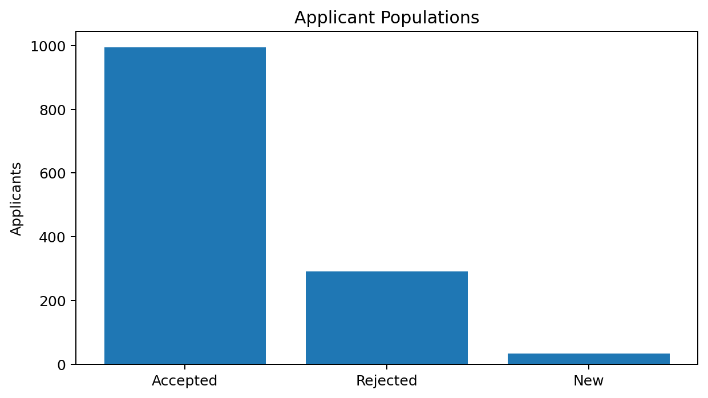
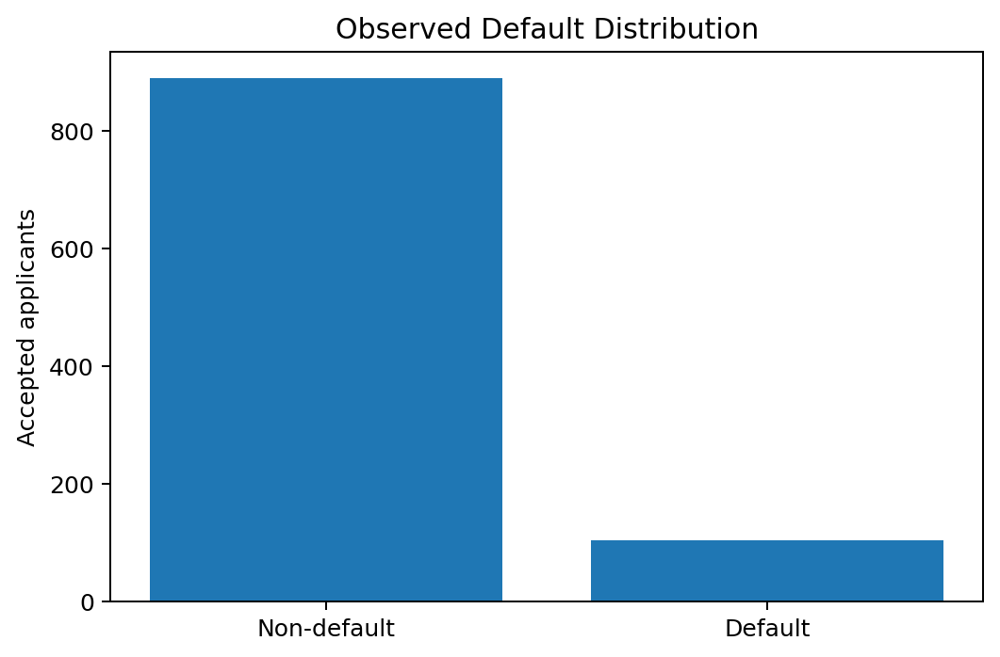
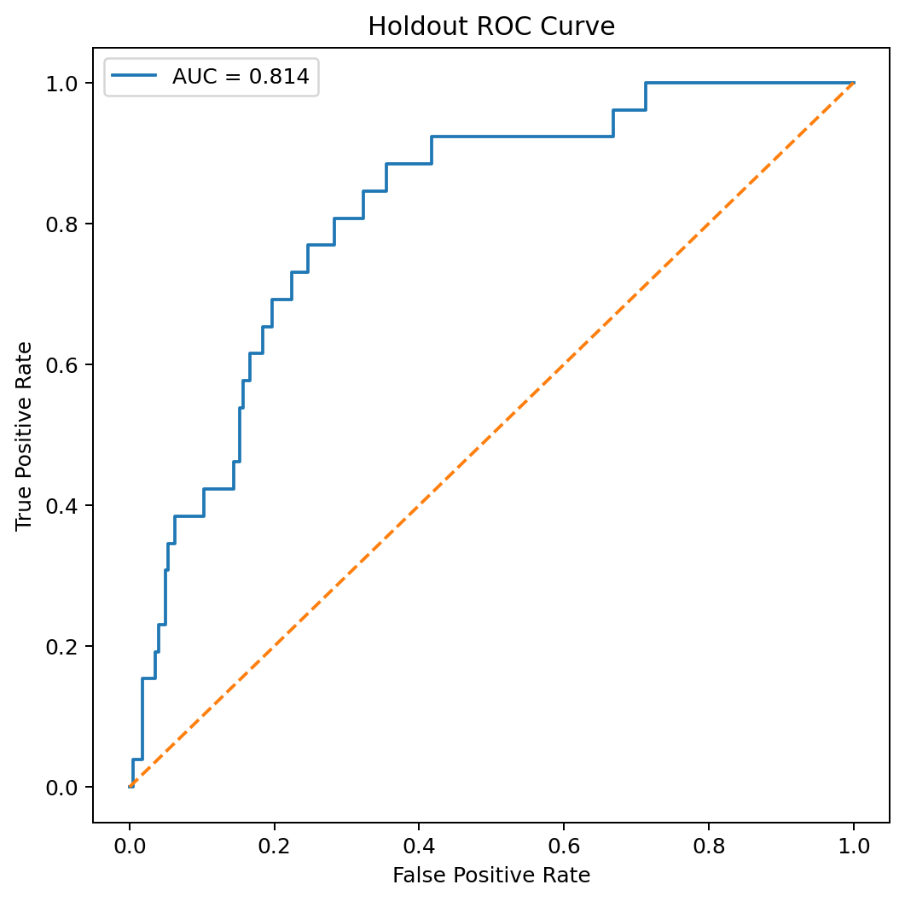
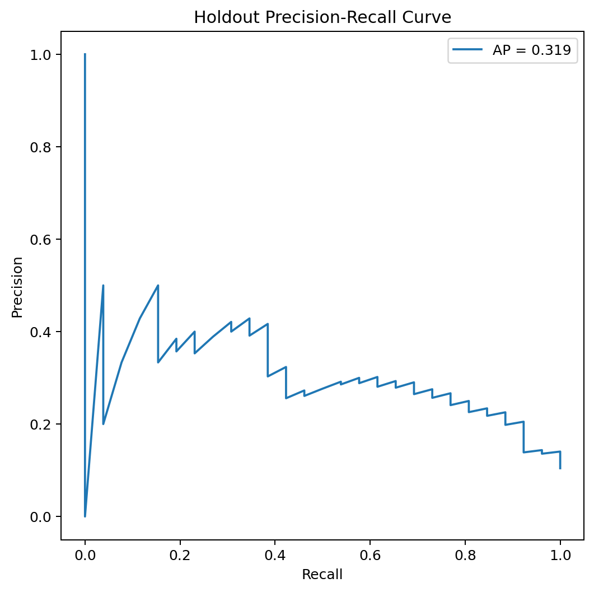
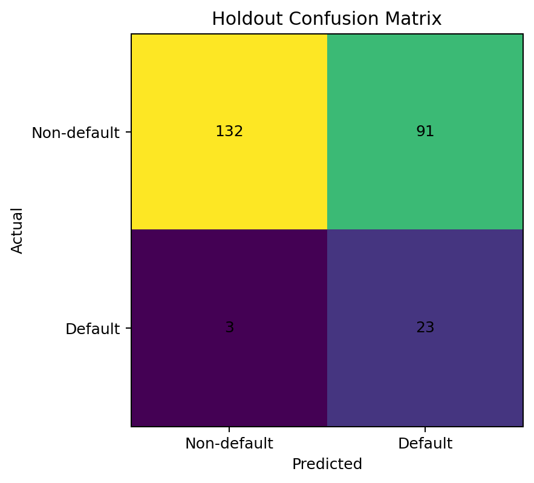
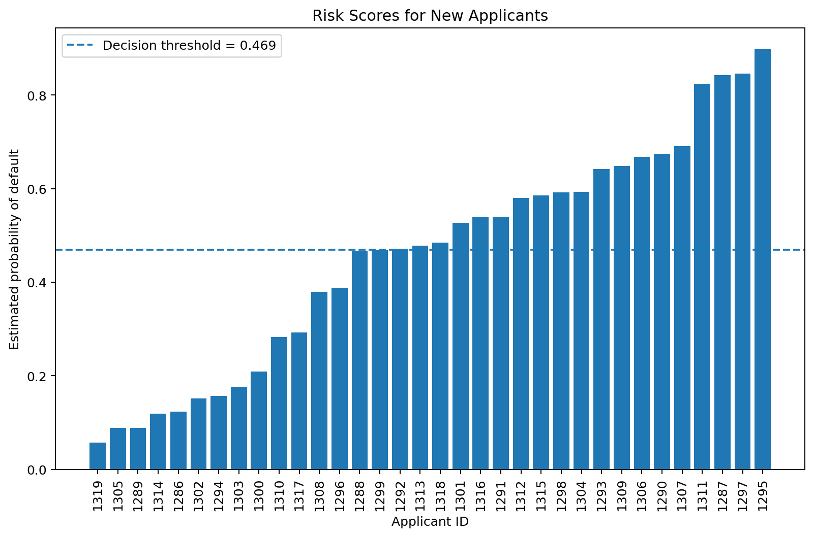

# Credit Risk Scoring with Reject Inference

### Leakage-aware credit admission modeling, reject inference and applicant scorecard

This project develops a credit-risk scoring workflow for card applicants using a dataset with **accepted, rejected and new applications**.

Only accepted customers have observed default outcomes, creating the classic credit-scoring problem of **selection bias**. The project therefore combines careful data cleaning, leakage-aware feature definition, logistic risk modeling and transparent reject inference.

---

## Project Highlights

- **1,319 total applications**
- **994 accepted** applicants with observed outcomes
- **291 rejected** applicants with unknown default outcomes
- **34 new applicants** to score
- Rigorous data-quality audit
- Detection of impossible age values
- Explicit treatment of structurally unavailable variables
- Logistic regression with class balancing
- Regularization selected by training-only cross-validation
- Out-of-fold threshold selection
- Hard-cutoff reject inference
- Probability of Default (PD)
- Points-based credit score
- Holdout validation
- Comparison with graded academic answer examples

---

## Why the Cleaning Matters

Two fields create a major modeling issue:

- `Avgexp`
- `Exp_Inc`

For **all 291 rejected applicants** and **all 34 new applicants**, both variables are zero.

For accepted customers, they represent observed card expenditure information.

That means they are not available on the same basis at the moment of admission. The professional model excludes them rather than allowing post-acceptance information to distort the new-applicant score.

The dataset also contains ages below 18 and above 80. These values are treated as invalid and imputed inside the model pipeline.



---

## Applicant Populations



Among the 994 accepted applicants:

- 890 are observed non-defaults
- 104 are observed defaults
- observed default rate = **10.46%**



---

## Methodology

```text
Raw applications
      ↓
Accepted / Rejected / New separation
      ↓
Data-quality audit
      ↓
Application-time feature definition
      ↓
Development / holdout split
      ↓
Training-only cross-validation
      ↓
Out-of-fold PD threshold
      ↓
Accepted-only logistic model
      ↓
Reject inference
      ↓
Augmented logistic model
      ↓
Untouched holdout evaluation
      ↓
Score 34 new applicants
```

Full details: [`docs/methodology.md`](docs/methodology.md)

---

## Holdout Performance

| Metric | Result |
|---|---:|
| ROC-AUC | **0.8141** |
| Average Precision | **0.3189** |
| Balanced Accuracy | **0.7383** |
| Default Recall | **0.8846** |
| Default Precision | **0.2018** |
| Default F1 | **0.3286** |







The model detects **23 of 26** defaults in the untouched holdout sample.

---

## Reject Inference

The rejected population has no observed `default` label.

The project uses a transparent **hard-cutoff reject inference** approach:

1. Train an initial model on accepted development data.
2. Estimate PD for rejected applicants.
3. Assign pseudo-labels using a threshold selected from out-of-fold development predictions.
4. Refit the model using accepted development observations plus pseudo-labeled rejected applicants.
5. Evaluate only on the untouched accepted holdout set, where ground truth is genuinely observed.

This does not make the rejected labels “true”; it is an explicit modeling assumption.

---

## New Applicant Scoring

The final model produces:

- Probability of Default
- Credit score
- Approve / Decline recommendation

for all **34 new applicants**.



The analytical decision threshold is:

- PD threshold: **0.4692**
- Equivalent score threshold: **381.37**

Higher scores represent lower estimated risk.

---

## Academic Reconstruction

The original graded exercise also required Information Value calculations.

The user's corrected quiz shows, for example:

- `Avgexp`: IV **0.271663**
- `Age`: IV **0.224977**
- `Income`: IV **0.222999**
- `Cur_add`: IV **0.192857**

The complete table is preserved in:

`results/academic_iv_reference.csv`

The academic values are retained as a reconstruction benchmark, while the professional admission model applies stricter feature-availability rules.

The model independently agrees with **12 of 14 (85.7%)** corrected decisions shown in the graded Question 9 examples.

See [`docs/academic_reconstruction.md`](docs/academic_reconstruction.md).

---

## Repository Structure

```text
credit-risk-scoring-reject-inference/
├── data/
│   └── README.md
├── docs/
│   ├── academic_reconstruction.md
│   └── methodology.md
├── images/
│   ├── accepted_default_distribution.png
│   ├── age_quality_check.png
│   ├── applicant_populations.png
│   ├── confusion_matrix.png
│   ├── model_coefficients.png
│   ├── new_applicant_pd.png
│   ├── precision_recall_curve.png
│   └── roc_curve.png
├── notebooks/
│   └── credit_risk_scoring_reject_inference.ipynb
├── results/
│   ├── README.md
│   ├── academic_iv_reference.csv
│   ├── confusion_matrix.csv
│   ├── data_quality_summary.csv
│   ├── graded_decision_benchmark.csv
│   ├── holdout_metrics.csv
│   ├── model_coefficients.csv
│   ├── model_selection_cv.csv
│   └── new_applicant_scores.csv
├── src/
│   ├── __init__.py
│   └── scoring.py
├── .gitignore
├── README.md
└── requirements.txt
```

---

## Reproducibility

Install:

```bash
pip install -r requirements.txt
```

Then place the original workbook at:

```text
data/DatosPractica_Scoring.xlsx
```

and run:

```text
notebooks/credit_risk_scoring_reject_inference.ipynb
```

The public repository excludes the original academic workbook, but the notebook is saved with executed outputs.

---

## Limitations and Governance

Credit decisions are high-stakes.

This project is an educational portfolio analysis and **not a production lending policy**. A real deployment would require validation, calibration, fairness testing, explainability, legal review, stability monitoring, adverse-action reason governance and ongoing model-risk management.

---

## Skills Demonstrated

**Python · Credit Risk · Logistic Regression · Reject Inference · Data Cleaning · Cross-Validation · ROC-AUC · Precision-Recall · Probability of Default · Scorecards · Model Governance**

---

## Author

**Anastasia García Reziapova**

Data Science / Credit Risk Portfolio Project
